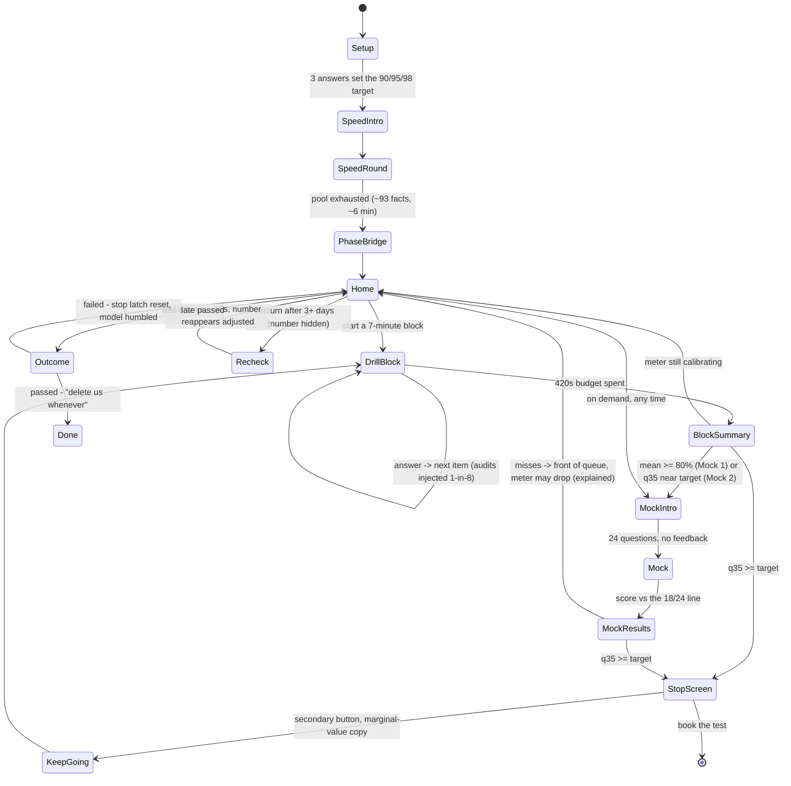
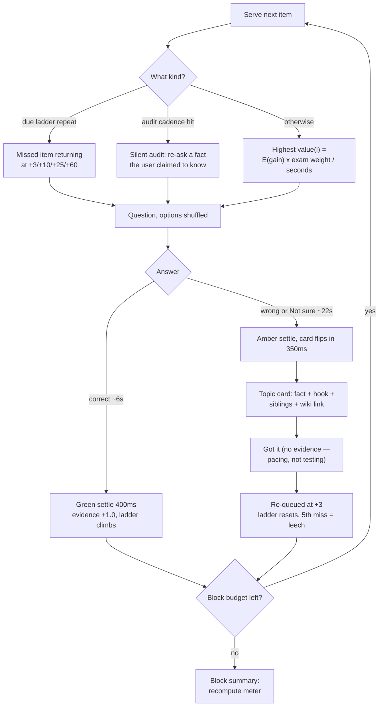
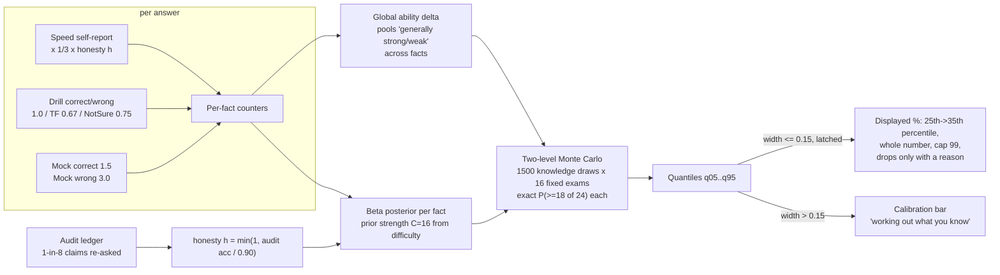
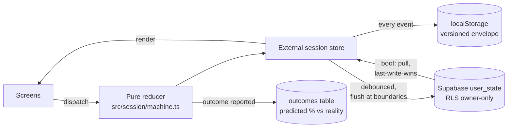

# Ready v1 — Design Decisions & How It Works

This is the decision log for the v1 build. Every call that shapes the product
is flagged **[DECISION]** with its rationale, so any of them can be revisited.
Diagrams are mermaid — GitHub renders them inline.

Companion docs: [README.md](README.md) (run/deploy), [data/README.md](data/README.md) (data provenance),
`src/model/tuning.ts` (every tunable constant in one file).

---

## 1. What got built

A single-page web app (Vite + React + TS) implementing the full Ready v0.1
spec arc:

**Setup (3 questions) → Speed round (~93 easy facts, self-report) → 7-minute
drill blocks with silent honesty audits → calibration bar → live pass-probability
meter → Mock 1 (~80%) → targeted drilling → Mock 2 (near target) → stop screen →
post-test outcome collection.**

- **Content**: all 408 questions from the 17 scraped practice exams, clustered
  into **280 testable facts** backed by **96 topic-level knowledge cards**
  (fact + hook + wiki link), 100% coverage, pipeline-validated.
- **Model**: per-fact Beta posteriors + a global ability offset, honesty-audit
  discounting, return decay, and a two-level Monte Carlo that turns the whole
  thing into one number and one interval.
- **Backend**: Supabase (magic-link login, cross-device sync, event log,
  outcome collection) — **optional**; the app is fully functional in guest
  mode with localStorage.
- **Verification**: 45 automated tests, including a calibration E2E that
  drives synthetic users (honest, liar, strong, weak) through the real
  reducer from cold start to stop screen, plus a scripted browser
  click-through.

---

## 2. The journey

## 3. The drill loop (one item)

## 4. How the number works

Why two levels: the outer draws sample *what the user might truly know*
(the uncertainty that shrinks with evidence — what the bar measures); the
inner 16 exams are drawn **once** and reused across all draws (common random
numbers), so bad-luck-of-the-exam-draw noise stays inside each estimate
instead of inflating the interval. Without CRN the interval never narrows
and the meter never unlocks — we verified this by simulation before building.

## 5. Sync architecture

---

## 6. Decision log

### Adopted straight from the spec

| Decision | Where |
|---|---|
| MCQ is the atomic unit; card is the response to failure | `Question.tsx`, `machine.ts` |
| "Not sure" affordance on every question (soft-miss evidence, 0.75 weight) | `Question.tsx` |
| Speed round = self-report, no scoring language, bar not score | `SpeedScreen` |
| Silent audits ~1-in-8 claims, proportional discounting, never disclosed | `audits.ts`, `audit.ts` |
| Amber for wrong answers, never red; no shake/buzz; card flips in 350ms | `tokens.css`, `motion.css` |
| Meter: two lives (calibration bar → live %), one celebration moment | `meter.ts`, `BlockSummary` |
| Whole percent, cap 99, never drops without a visible reason | `meter.ts` (monotone display rule) |
| "Based on N questions we've seen you answer" under the number | `Meter` component |
| Mock misses → front of queue; model quick to lower (wrong ×3.0), slow to raise (right ×1.5) | `tuning.ts` |
| Stop rule at 90/95/98 from the retake-pain setup question | `TARGET_BY_PAIN` |
| Repeat ladder +3/+10/+25/+60 positions; leech cut-off at 5 misses | `queue.ts` |
| Items/minutes not days; single-evening use fully served | scheduler throughout |
| Decay: nothing < 3 days, exponential to a 0.35 floor; 20-item re-check gates the number | `decay.ts` |
| Post-test outcome screen (P0) | `Outcome` + `outcomes` table |
| No streaks, no lives, no mascot, no retention mechanics | everywhere |

### Changed from the spec — with reasons

| # | Spec said | We shipped | Why |
|---|---|---|---|
| 1 | Speed-round eligibility ≥85% population correct-rate, 80–120 items | **≥80% prior (difficulty ≤4) → 93 facts** | Only ~61 facts clear 85% in this bank. 93 keeps the round at ~6 min and — more importantly — keeps the audit pool big enough to measure honesty. |
| 2 | Meter unlocks at interval width ~12 points, ~120–140 responses | **Width ≤ 15 points** (latched), lands in the same response window | P(pass) is hypersensitive to accuracy near the 75% pass mark: ±5 accuracy points ≈ ±20–30 pass-probability points (the spec's own anchor table). A hard 12 costs ~2× more responses before the number appears. One constant (`METER_WIDTH_UNLOCK`) if you want it stricter. |
| 3 | Poisson-binomial by plain simulation | **Two-level Monte Carlo with common random numbers + a global ability offset (Rasch-lite)** | A one-level simulation's interval is dominated by exam-draw luck and *never* narrows — the meter would never unlock. Independent per-fact estimates also can't pool "this user is generally strong"; the ability offset fixes that. Both were verified by simulation before implementation. |
| 4 | Mock 1 at "~80% predicted" | **Mean ≥ 80% triggers; display stays conservative** | If the trigger used the conservative displayed percentile, Mock 1 would fire far too late for cautious displays. |
| 5 | Display 35th percentile, start at 25th until calibrated | **25th → 35th ramp over the first 60 evidence units post-unlock** | Same conservatism, but as a smooth ramp the drift is upward — the user sees the number "warming up", never a silent drop. |
| 6 | "Never repeat an item within a block" | **Clean items never repeat; missed items may (+3 ladder)** | The two spec rules contradict each other for 7-minute blocks. Re-showing a just-missed fact is the pedagogy working. |
| 7 | One fact per card | **Topic-level cards** (per product owner): one card carries all sibling facts for a topic, reused across its questions | The missed fact is highlighted; siblings sit behind a "More on this topic" expander so the 15-second read rule still holds. Wiki link-outs per card. |
| 8 | No accounts ("nothing to sign up for") | **Optional magic-link accounts + guest mode** (per product owner) | Guest mode is the default path; sign-in exists for cross-device sync and makes outcome collection durable. The app never requires it. |

### New decisions the spec didn't cover

| # | Decision | Rationale / revisit knob |
|---|---|---|
| 9 | **Fact granularity = testable atom** (280 facts), clustered by theme + keyed answer + stem similarity, then regrouped under the human card file | "Armada = 1588" and "Armada sent by Spain" are separate atoms — knowing one doesn't imply the other. The card file (`data/cards.json`) is authoritative for grouping; edit it and rebuild. |
| 10 | Difficulty (1–10, editorial) → prior correct-rate via a fixed table (1→.95 … 9→.40) | Self-corrects per-user via the ability offset and mocks. Table in `tuning.ts`. |
| 11 | Exam weight per fact = 24 × theme share / facts-in-theme | Theme share from the 408-question distribution — our best proxy for the real test's topic mix. |
| 12 | TF correct answers earn 0.67 evidence (not 1.0) | A coin-flip guess is right half the time; full credit would inflate confidence. |
| 13 | Card "Got it" taps generate **no** evidence | Reading a card isn't proof of learning; the +3 re-ask is the proof. Keeps the meter honest. |
| 14 | Mock sampling uses the same theme-weighted sampler as the pass simulation, leeches included | The mock must estimate the real test, not the curated queue. |
| 15 | Failed real test → stop latch resets, ability nudged down 0.05, meter drop armed | The model eats humble pie visibly but doesn't collapse. |
| 16 | Sync = last-write-wins on `lastActiveAt`; localStorage is the write-through source | Simple and predictable for v1. Two-device simultaneous study can lose the smaller session — flagged; a counter-merge is the v1.1 upgrade. |
| 17 | Question components remount per serving (React `key`) | Post-mortem of a real bug: answer-lock state leaking into the next question froze the UI. Regression-tested now. |
| 18 | Answer delivery is idempotent (variantId guard) with backup timer + visibility flush | Browsers pause timers in background tabs; a user switching apps mid-answer must not return to a frozen screen. |

### Copy & design system

Implemented per spec §13–18: bone `#FAF8F5`, ink `#1F1E1C`, clay `#D97757`
accent, muted green confirmations, **amber `#C98A2E` wherever red would be
conventional**; serif stems (Charter/Georgia stack), sans UI; one decision per
screen; ≥56px targets; `prefers-reduced-motion` respected; aria-live meter
announcements; keyboard: 1/2 in the speed round, full tab operation.
Copy has no exclamation marks and celebrates readiness, not persistence
("We've taken 62 things off your list", "That mock found some gaps — better
here than in the test").

---

## 7. The tuning table

Everything lives in `src/model/tuning.ts`. The load-bearing ones:

| Constant | Value | Meaning |
|---|---|---|
| `PRIOR_STRENGTH_C` | 16 | How much the difficulty prior resists early evidence |
| `SELF_REPORT_WEIGHT` | ⅓ | A "knew it" tap vs a real correct answer |
| `MOCK_WRONG_W` / `MOCK_CORRECT_W` | 3.0 / 1.5 | The quick-down-slow-up asymmetry |
| `AUDIT_RATE` | 8 | 1-in-8 claims silently re-asked |
| `AUDIT_HONEST_BASELINE` | 0.90 | Honest people still miss ~10% vs distractors |
| `METER_WIDTH_UNLOCK` | 0.15 | Interval width that unlocks the number |
| `MOCK1_MEAN_THRESHOLD` | 0.80 | Mock 1 trigger |
| `BLOCK_SECONDS` | 420 | The 7-minute block |
| `LADDER_OFFSETS` | 3, 10, 25, 60 | Missed-item re-show positions |
| `LEECH_MISSES` | 5 | Stop showing an item; absorb its cost honestly |
| `DECAY_DEAD_DAYS` / `TAU` / `FLOOR` | 3 / 14 / 0.35 | Return-gap forgetting curve |

---

## 8. Content pipeline

`npm run build:bank` (deterministic, fails loudly):

1. Parse `data/life_in_uk_questions.csv` (408 rows, answer keys verified
   against options — includes 33 pick-two and one pick-three question, and 57
   two-option questions).
2. Auto-cluster same-fact questions (theme + normalized answer set;
   two-option questions additionally need stem similarity so four unrelated
   "False" answers don't merge).
3. Join `data/cards.json` — **96 topic cards, 280 card-facts, every question
   covered exactly once** (LLM-drafted, grounded in the scraped explanations,
   with the ~10 documented source flaws corrected: Channel Islands are Crown
   dependencies, Trafalgar was against the combined French *and* Spanish
   fleet, the BBC is licence-fee funded, the Senedd/NI Assembly naming, etc.
   Keyed answers are never altered — the user is training for these
   questions as scored).
4. Compute per-fact difficulty, prior, exam weight, speed-round eligibility.
5. Validate: 408 variants, answer-in-options, weights sum to 24, every fact
   carded; emit `src/content/bank.json`.

To edit content: change `data/cards.json` (statements, hooks, wiki links,
groupings) and rebuild. The pipeline enforces that each statement still
contains its keyed answer.

---

## 9. What's verified

| Layer | Tests |
|---|---|
| Pass math | Monte Carlo matches the exact binomial at the spec's anchors (75%→0.607, 80%→0.811, 85%→0.943, 90%→0.993) |
| Model | Evidence-table arithmetic, honesty factor cases (5/8 audits → 0.667), decay boundaries, meter monotone/cap/ramp rules |
| Scheduler | No clean repeats in a block, ladder offsets exact, leech at the 5th miss, audit cadence ⊆ claims, theme-share sanity of mock sampling |
| Whole product | **Calibration E2E**: synthetic honest/liar/strong/weak users through the real reducer — unlock lands in the intended window, liars end discounted, a well-prepared user reaches the stop screen |
| UI | jsdom click-through incl. wrong→amber→card and the correct-answer remount regression; scripted Chromium run (setup → speed → block summary, reload persistence, 200% zoom) |

45 tests, all green. `npm test`.

---

## 10. Known limitations (honest list)

1. **Difficulty priors are editorial**, not measured from users. The ability
   offset absorbs per-user miscalibration; population-level correction needs
   real response data (the `events` table is already collecting it).
2. **Sync is last-write-wins** — see decision 16.
3. **Supabase paths are tested against a mocked client**, not a live
   project (no Docker in the build environment). The SQL migration is
   idempotent and RLS-complete; first live login is the remaining manual QA.
4. **The 2-hour claim isn't re-validated in-app yet**: the spec's
   personalised "time remaining" estimate is derivable from the scheduler's
   expected-seconds math but isn't displayed in v1.
5. **No images on cards** (schema has `wikiUrl`; an image field is a
   backwards-compatible addition).
6. **Dark mode deferred** per spec.
7. **Bundle is ~181KB gzipped** — fine, but supabase-js (~40KB) could be
   lazy-loaded behind the sign-in tap.

## 11. Suggested next steps

1. Wire a tiny reliability dashboard off the `outcomes` table (predicted %
   vs actual pass rate — the spec's A.4 calibration loop).
2. Counter-level merge for two-device sync.
3. Live "estimated minutes remaining" next to the meter.
4. A content pass on the 96 cards by a human editor — hooks especially
   (they're good; they can be great).
5. Real-user difficulty recalibration once ~1k responses exist.
